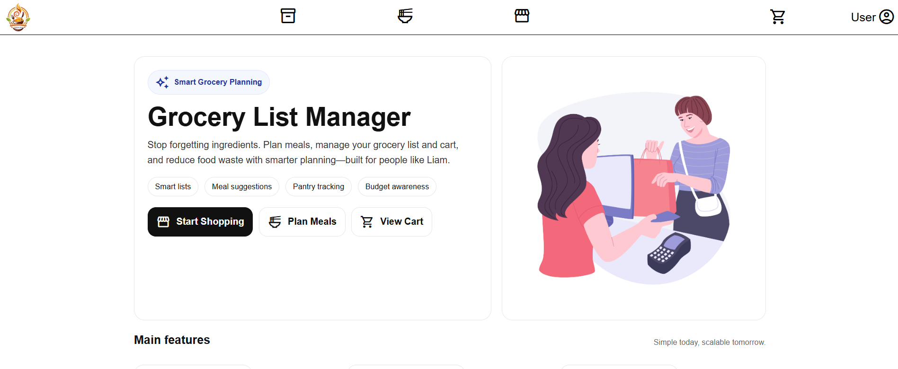
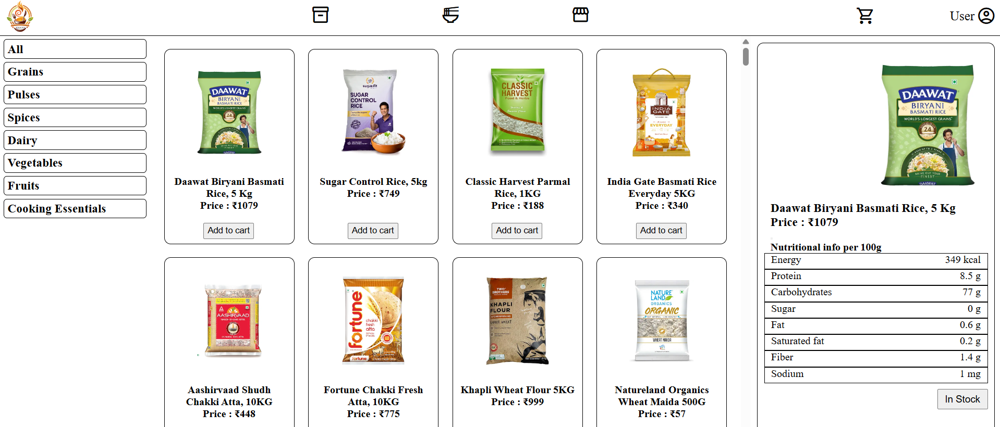
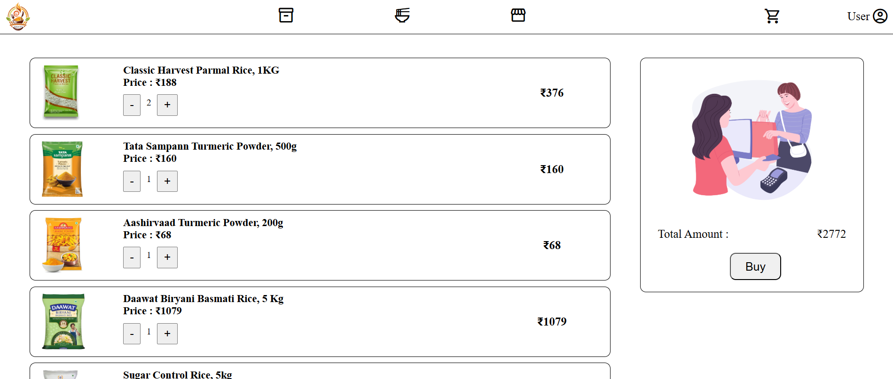
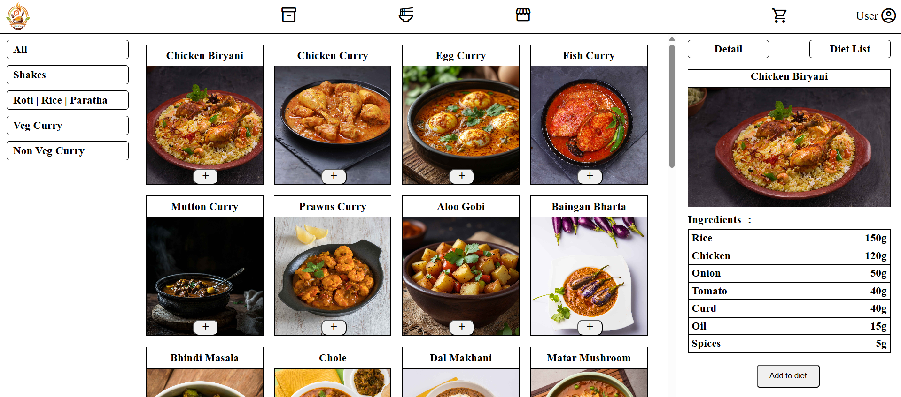

# 🛒 Grocery List Manager

A front-end **Grocery List Manager** built using **HTML, CSS, and vanilla JavaScript** to simplify grocery planning, meal preparation, and budget-aware shopping.  
The app focuses on reducing food waste, improving planning, and making grocery shopping more efficient for everyday users like *Liam*.

---

## 🌐 Live Demo
https://candid-buttercream-efecb2.netlify.app/

---

## 📸 Screenshots

### Landing Page


---

### Store (Browse Items)


---

### Cart


---

### Meal Planner


---

## 🎯 Project Context

- Grocery list creation  
- Meal planning  
- Cart & budget awareness  
- Pantry-style thinking  

All in a **simple, client-side web app** without heavy frameworks.

---

## ✨ Features

- ✅ Browse grocery items by category
- ✅ Add items to cart with quantity management
- ✅ Persistent cart using `localStorage`
- ✅ Meal planning with ingredient calculation
- ✅ Diet list storage using `localStorage`
- 🚧 Pantry / Bag management (work in progress)
- 🚧 Advanced budgeting & analytics (planned)

---

## 📁 Project Structure

```txt
GROCERY_LIST_MANAGER/
│
├── images/
│ ├── KHANA_LOGO.svg
│ ├── purchase.jpg
│ └── readme/
│
├── index.html # Landing page
├── store.html # Grocery store / catalog
├── cart.html # Cart page
├── food.html # Meal planner
├── bag.html # Pantry / bag (WIP)
│
├── store.js
├── cart.js
├── food.js
├── bag.js
│
├── storeData.js # Product data (to be standardized)
├── README.md
└── LICENSE
```

---

## 🧠 Concepts Demonstrated

### 🗂️ Client-Side State Management
- Usage of **`localStorage`** for:
  - Cart persistence
  - Diet / meal planning data
- Manual state updates without frameworks

---

### 🧱 Modular Front-End Architecture
- Separate HTML + JS per page
- Clear responsibility per file (store, cart, food, bag)
- Reusable UI patterns across pages

---

### 🔄 Data Handling & Logic
- Category-based filtering using `Array.filter`
- Quantity calculations and subtotal logic
- Ingredient aggregation and unit conversion (grams → kg)

---

### 🎨 UI & UX Fundamentals
- Responsive layout (desktop & mobile)
- Clean navigation flow between pages
- Clickable product cards with detail view
- Visual feedback on user actions

---

### 🧪 Vanilla JavaScript Practices
- DOM manipulation without libraries
- Event handling & propagation control
- Defensive coding for missing or empty data
- Separation of concerns between UI & logic

---

## 🚀 How to Run Locally

1. **Clone the repository**
```bash
git clone https://github.com/your-username/grocery-list-manager.git
```
2. **Navigate into the project**
```bash
cd grocery-list-manager
```
3. **Open in browser**
```bash
open index.html
```
> Just double click on index.html file to open it.

## 🛠️ Tech Stack

### Frontend
- **HTML5** – Semantic structure and layout
- **CSS3** – Responsive styling and UI design
- **Vanilla JavaScript (ES6+)** – Core logic, DOM manipulation, and state handling
- **Browser localStorage** – Client-side data persistence for cart and meal planning

---

## 🌱 Future Improvements

- Implement a complete **Pantry / Inventory management system**
- Link **meal planning** directly with pantry quantities
- Add **budget limits and spending alerts**
- Standardize and clean up product data (`storeData.js`)
- Improve **empty state handling** across all pages
- Deploy a **live demo** for public access
- Optional **backend integration** for authentication and multi-user support

---

## 📄 License

This project is licensed under the **MIT License**.

---

## 👤 Author

**Ram Pravesh Sharma**  
🐙 GitHub: https://github.com/rampravesh164191/grocery_list_manager 
🌐 Portfolio: https://your-portfolio.com
